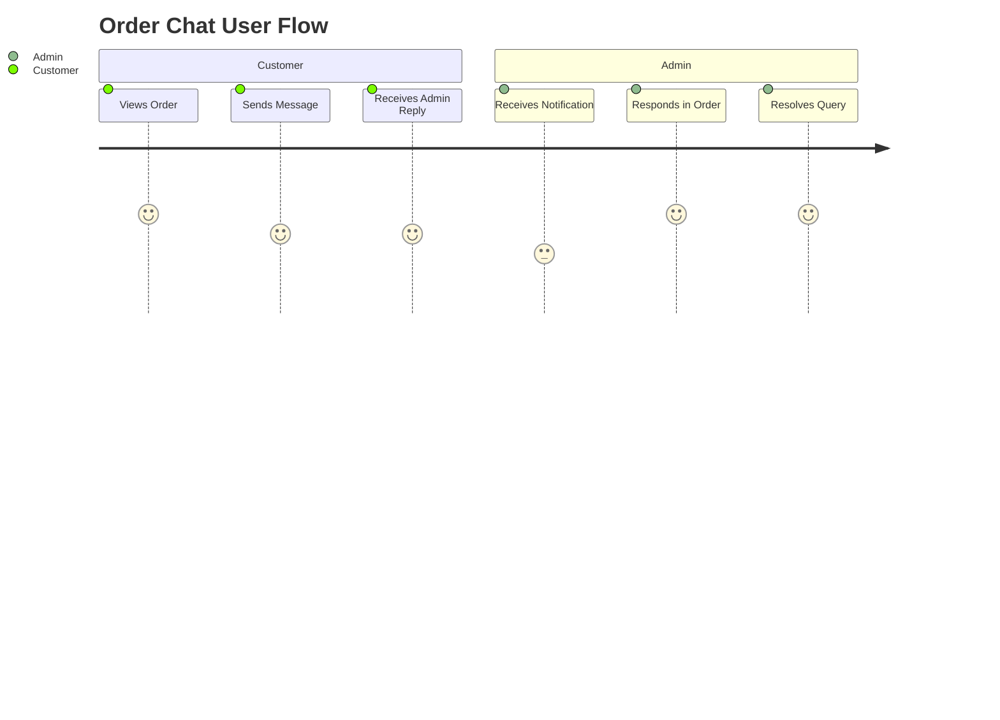

# WooCommerce-Order-Chat

## Introduction

WooCommerce-Order-Chat is a powerful WordPress plugin that enables real-time chat functionality between customers and shop managers for individual WooCommerce orders. By integrating seamlessly with WooCommerce, this plugin enhances customer service and post-purchase engagement, letting users discuss order-specific issues or requests directly within their account dashboard and the WordPress admin.

## Features

- Real-time chat for each WooCommerce order between customers and administrators.
- Chat threads linked to specific orders for easy reference and history tracking.
- AJAX-powered message sending for a seamless user experience.
- Message notifications for both customers and admins when new messages arrive.
- Clean and user-friendly interface integrated into both the WooCommerce My Account section and the admin order details page.
- Support for attachments (if enabled).
- Extensible codebase for customization and integration with additional workflows.

## Usage

After activating the plugin, customers will see a new "Order Chat" option in their WooCommerce My Account order view. Administrators get a chat panel inside each order’s details page in the WordPress dashboard. Both parties can send and receive messages about the order, ensuring quick resolution of queries, clarifications, and support needs.

Typical usage flow:

1. Customer places an order in WooCommerce.
2. Customer opens their order details and starts a chat regarding their order.
3. Admin receives a notification and responds from the order edit page.
4. All communication is threaded and visible to both parties, streamlining support.

### User Journey Example



## Installation

To install WooCommerce-Order-Chat:

1. Download or clone the repository to your local machine:
    ```bash
    git clone https://github.com/RutvaAWT/WooCommerce-Order-Chat.git
    ```
2. Copy or upload the plugin folder to your WordPress installation’s `wp-content/plugins/` directory.
3. Log in to your WordPress admin dashboard.
4. Go to **Plugins** > **Installed Plugins** and activate "WooCommerce Order Chat".
5. Ensure WooCommerce is activated, as the chat plugin depends on it.
6. Configure any plugin settings as required (if available).

## Requirements

- WordPress 5.0 or later.
- WooCommerce 4.0 or later.
- PHP 7.2 or higher.
- jQuery (typically included with WordPress themes).
- Proper file permissions for uploading attachments (if attachment support is enabled).

---

For further customization, refer to the plugin's hooks and filters in the codebase. If you encounter issues, please open an issue on the GitHub repository with detailed steps to reproduce.

Happy chatting!
